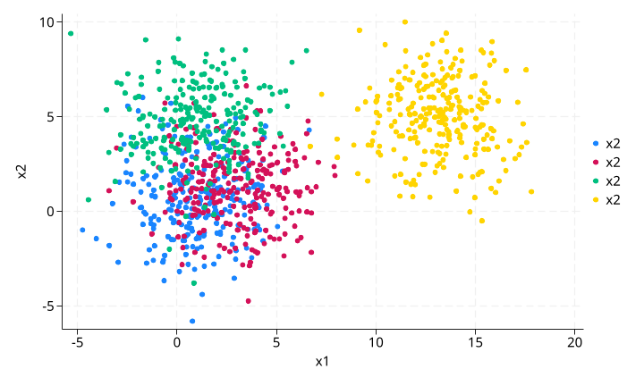
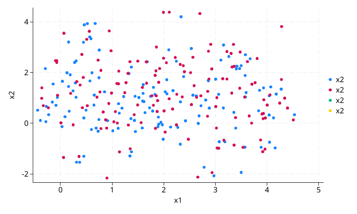
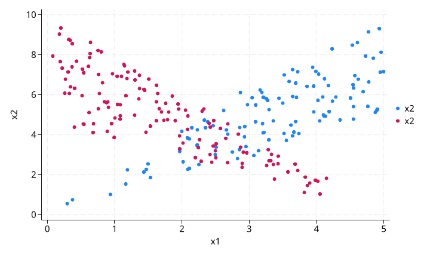
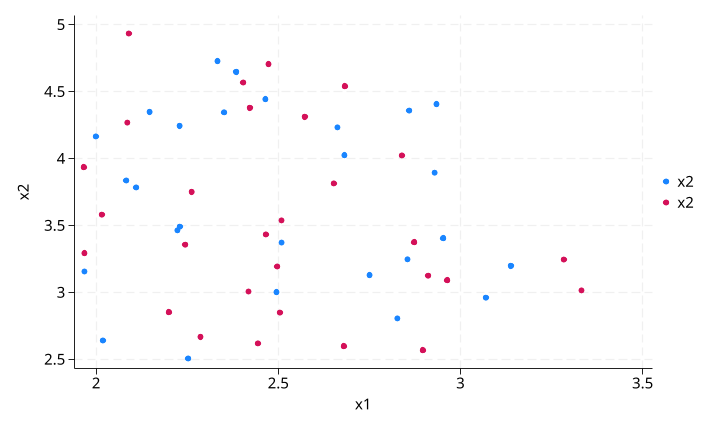

# csadensity 使用示例

本文档基于 `test/csa/test_csa.do` 中的两个测试场景，说明 `csadensity` 命令的核心功能与使用原因。

---

## 命令简介

`csadensity` 用于识别处理组（treatment）与对照组（control）在多维协变量空间中的**共同支持域（Common Support Area, CSA）**。其原理是：对每个观测点，分别用处理组和对照组的数据做核密度估计，取两个密度的较小值并进行归一化，最终将归一化密度高于阈值的观测标记为共同支持域（`csa=1`）。

数学上：

- $f_t(\mathbf{x})$ = 用处理组观测估计的核密度
- $f_c(\mathbf{x})$ = 用对照组观测估计的核密度
- $g(\mathbf{x}) = \min(f_t(\mathbf{x}), f_c(\mathbf{x}))$
- $g_{\text{norm}}(\mathbf{x}) = g(\mathbf{x}) / \max(g)$

当 $g_{\text{norm}} > \text{threshold}$ 时，该观测被标记为 CSA。

---

## 测试一：分组共同支持域（group 选项）

### 测试目的

验证 `group()` 选项的功能：当数据存在明显的子群体异质性时，应在每个子群内部独立计算 CSA，避免将不同子群之间的分布差异误判为缺乏共同支持。

### 数据构造

生成 1000 个观测，包含：
- `treatment`：二元处理变量（0/1）
- `g`：分组指示变量（0/1）
- `x1`：均值为 `1 + 2*treatment + 10*treatment*g`，标准差为 2 的正态分布
- `x2`：均值为 `1 + 4*g`，标准差为 2 的正态分布

**关键设计**：当 `g=1` 且 `treatment=1` 时，`x1` 的均值约为 13，与其他三组（均值在 1~5 之间）明显分离。但在每个 `g` 组内部，处理组与对照组是有重叠的。

### 可视化结果

**原始数据散点图**（四组）：

图中颜色区分：
- 蓝色：`treatment=0, g=0`
- 红色：`treatment=1, g=0`
- 绿色：`treatment=0, g=1`
- 黄色：`treatment=1, g=1`

可以清楚看到，黄色组（`treatment=1, g=1`）在 `x1` 维度上与其他三组完全分离。

**执行 `csadensity` 后（保留 `csa=1` 的观测）**：

命令：`csadensity x1 x2, group(g) treatment(treatment) gen(csa)`

**结果解读**：黄色组被完全过滤掉。原因是在 `g=1` 组内，处理组（黄色）与对照组（绿色）的 `x1` 分布几乎没有重叠——对照组 `x1` 均值约 1，处理组约 13。由于我们在每个 `g` 组内分别计算 CSA，这种组内缺乏重叠的情况被正确识别。

**为什么做这个测试**：如果不使用 `group(g)` 选项，而是全局计算 CSA，那么黄色组中的处理组观测可能会因为与对照组中其他 `g=0` 的观测在 `x1` 上有重叠而被错误地保留。`group()` 选项确保 CSA 判断在每个子群内部进行，符合因果推断中"组内可比性"的要求。

---

## 测试二：基本共同支持域识别

### 测试目的

验证 `csadensity` 的核心功能：在二维协变量空间中，识别处理组与对照组分布重叠的区域。

### 数据构造

生成 1000 个观测，`x1` 和 `x2` 均为均匀分布，然后通过条件删除构造一个中间重叠区域：
- 对照组（`treatment=0`）：删除 `x2 > 2*x1` 或 `x2 < x1` 的区域外的观测
- 处理组（`treatment=1`）：删除 `x2 > -2*x1 + 10` 或 `x2 < -x1 + 5` 的区域外的观测

这导致两组数据呈交叉带状分布，中间有一个菱形重叠区域。

**关键洞察**：对照组和处理组在 `x1` 和 `x2` 各自的取值范围上几乎完全相同（`x1` 均为 0~5，`x2` 均为 0~10）。如果按传统的**逐变量 trimming**（即分别检查 `x1` 和 `x2` 的取值范围，然后取交集），**不会删掉任何观测**，因为两组的边缘分布范围高度重叠。然而，两组在**二维联合分布**上的重叠区域实际上很小——只有在中间菱形区域内，两组才同时有数据。这正是 `csadensity` 的核心价值：识别多维空间中的**联合分布重叠**，而非单变量的边缘重叠。

### 可视化结果

**原始数据散点图**：

蓝色为对照组（`treatment=0`），红色为处理组（`treatment=1`）。两组在中间区域有明显重叠，但边缘区域各自向外延伸。

**执行 `csadensity` 后（保留 `csa=1` 的观测）**：

命令：`csadensity x1 x2, treatment(treatment) generate(csa) debug`

**结果解读**：只保留了中间的重叠区域（约 `x1 ∈ [2, 3.5]`，`x2 ∈ [2.5, 4.5]`）。边缘那些只有一组存在数据的区域被正确排除。`debug` 选项保留了中间变量（`_csad_f_t`、`_csad_f_nt`、`_csad_f_geom`、`_csad_f_norm`），可用于进一步诊断密度估计的具体数值。

**为什么做这个测试**：在因果推断（如倾向得分匹配、双重差分等）中，使用缺乏共同支持的观测会导致外推偏差。这个测试展示了 `csadensity` 如何在多维协变量空间中自动识别出"两组都有足够数据"的安全区域，为后续分析提供可靠的样本筛选。

---

## 两个测试的核心差异

| 维度 | 测试一 | 测试二 |
|------|--------|--------|
| **核心功能** | `group()` 分组 CSA | 全局 CSA |
| **数据特点** | 四组数据，其中一组明显分离 | 两组数据，中间有重叠带 |
| **测试目的** | 验证子群异质性下的独立判断 | 验证二维空间中的重叠识别 |
| **关键选项** | `group(g)` | `debug` |
| **结果** | 分离组被完全过滤 | 只保留重叠菱形区域 |

---

## 使用建议

1. **存在子群体时必用 `group()`**：当协变量分布因性别、地区、行业等分组变量而有本质差异时，全局 CSA 可能失效，应在组内分别计算。
2. **阈值调节**：默认 `threshold(0.2)` 适用于大多数场景。若要求更严格的重叠，可降至 `0.1`；若希望保留更多观测，可提高到 `0.3`。
3. **配合 `debug` 诊断**：初步分析时建议加 `debug`，检查 `_csad_f_norm` 的分布，以确定合理的阈值。
4. **维度限制**：协变量维度越高，核密度估计越稀疏，CSA 可能过小。建议结合领域知识选择关键协变量。
