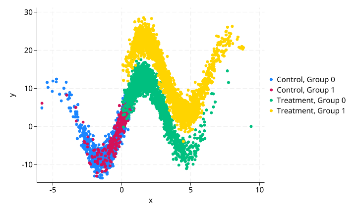
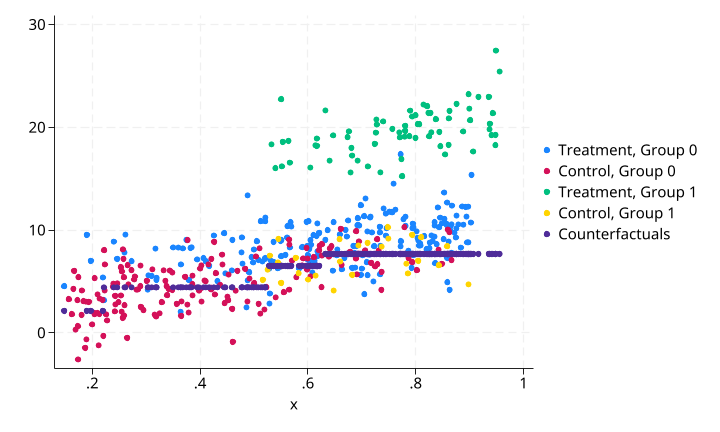
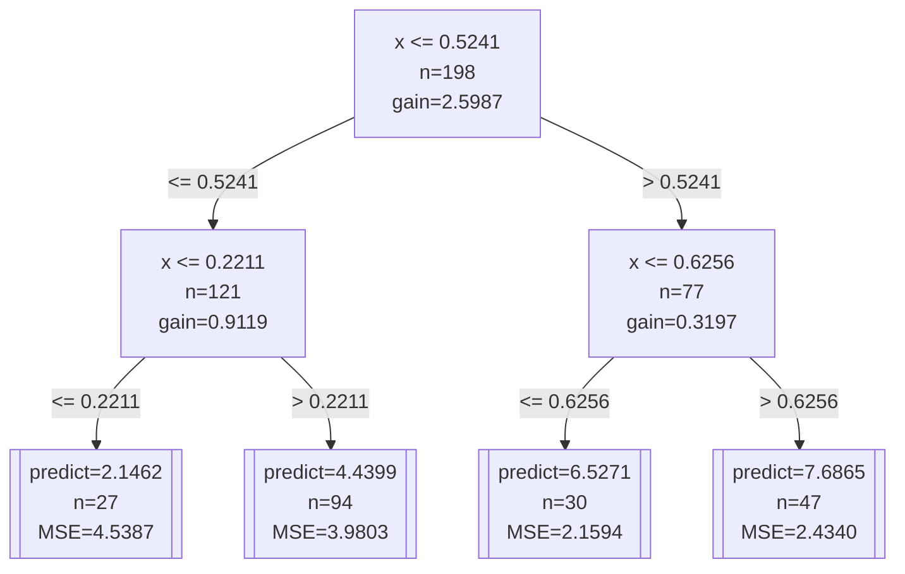
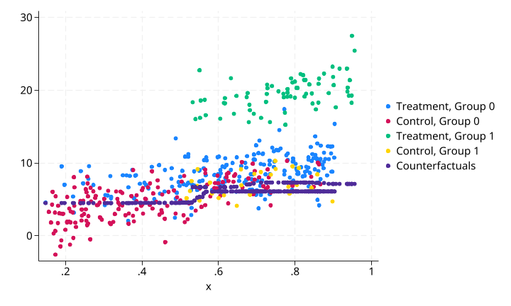

# fangorn 使用示例

本文档基于 `examples/fangorn/rf_with_treat.do` 中的两个测试场景，说明 `fangorn` 命令在因果推断中用于反事实预测的核心功能与使用原理。

---

## 命令简介

`fangorn` 是 CART 决策树与 Breiman 随机森林的 Stata 插件实现，支持回归（`type(regress)`）与分类（`type(classify)`）。其核心优势在于：

- **target 选项**：支持训练/预测分离。`target=0` 的观测用于训练模型，`target=1` 的观测仅接收预测但不参与训练。这一特性使其天然适合因果推断中的**反事实预测**场景。
- **group 选项**：支持多维度分组变量，字符串变量自动编码为数值。
- **随机森林**：`ntree(N)` 控制树的数量，N=1 为单决策树，N>1 为随机森林。
- **正则化**：`relimpdec()` 和 `maxleafnodes()` 控制树复杂度，防止过拟合。
- **Mermaid 导出**：`mermaid(filename)` 将单棵决策树导出为 Mermaid 流程图。

---

## 数据构造

两个测试使用相同的数据生成过程（DGP），模拟存在子群体异质性的处理效应估计场景。

生成 5000 个观测：
- `g = mod(_n,2)==0`：分组变量（0/1），模拟两个子群体
- `x ∼ N(1 + 2g, 2)`：协变量，不同组的均值不同（组0均值≈1，组1均值≈3）
- `treatment = x > runiform()`：处理变量，取值0/1，基于 x 的非随机分配
- `y = 1 + 2·treatment + 10·treatment·g + 10·sin(x) + ε, ε ∼ N(0, 2)`：结果变量

**关键设计**：处理效应存在显著的组间异质性——`g=0` 组的处理效应约为 2，而 `g=1` 组的处理效应约为 12（因为 `10·treatment·g` 项）。此外，`treatment` 的分配与 `x` 相关（非随机），直接比较处理组与对照组会有选择偏差。

**CSA 预筛选**：

```stata
csadensity x, group(g) treatment(treatment) gen(csa)
```

先使用 `csadensity` 识别处理组与对照组在协变量 `x` 上的共同支持域（CSA），仅在 CSA 内进行后续分析。执行后保留 473 个观测（共 5000 个），说明处理组与对照组在 `x` 上的重叠区域有限。

---

## 测试一：单决策树反事实预测（target 选项）

### 测试目的

验证 `fangorn` 在 `type(regress)` + `target()` 组合下的反事实预测能力：用对照组（`target=0`）数据训练决策树，然后预测处理组（`target=1`）在"未接受处理"条件下的反事实结果，进而估计个体处理效应。

### 执行命令

```stata
fangorn y x g, type(regress) target(treatment) gen(conterfacurals) if(csa==1) ///
    mermaid("rf_with_treat_mermaid.md")
```

- `target(treatment)`：`treatment=0` 的观测（对照组）用于训练，`treatment=1` 的观测（处理组）只接收预测
- `gen(conterfacurals)`：生成两个变量——`conterfacurals`（叶子节点 ID）和 `conterfacurals_pred`（预测值）
- `mermaid("rf_with_treat_mermaid.md")`：将决策树结构导出为 Mermaid 流程图

### 可视化结果

**原始数据散点图**（四组）：



图中颜色区分：
- 蓝色：`treatment=0, g=0`（对照组，组0）
- 红色：`treatment=1, g=0`（处理组，组0）
- 绿色：`treatment=0, g=1`（对照组，组1）
- 黄色：`treatment=1, g=1`（处理组，组1）

可以清楚看到 `y` 与 `x` 之间的非线性关系（`10·sin(x)` 项），以及不同组之间均值的明显差异。

**CSA + 反事实预测结果**：



灰色点（`conterfacurals_pred`）是处理组观测的反事实预测值——即如果它们未被处理（`treatment=0`），在给定 `x` 和 `g` 条件下的期望结果。

### 处理效应估计

```stata
gen te = y - conterfacurals_pred if treatment==1 & csa==1
bysort g: su te
```

| 组 | 观测数 | 均值 | 标准差 | 最小值 | 最大值 |
|---|-------|------|--------|--------|--------|
| g=0 | 204 | 2.117 | 2.230 | -3.911 | 9.704 |
| g=1 | 71 | 12.086 | 2.206 | 7.581 | 19.785 |

**结果解读**：单决策树成功捕捉到了组间处理效应的异质性：
- `g=0` 组：平均处理效应约 2.12，与真实 DGP 中的 `2·treatment` 项（效应=2）接近
- `g=1` 组：平均处理效应约 12.09，与真实 DGP 中的 `2·treatment + 10·treatment·g` 项（效应=12）接近

决策树能够自动利用 `g` 变量进行分裂，在不同子群中学习不同的预测模式。

### Mermaid 导出

执行后生成 `rf_with_treat_mermaid.md`，内容为决策树结构的 Mermaid 流程图：




决策树以 `x` 为根节点分裂阈值约 0.52，共 4 个叶节点。叶节点的 `predict` 值代表该子集中对照组的平均 `y` 值，范围从约 2.15 到 7.69。

---

## 测试二：随机森林反事实预测

### 测试目的

验证随机森林（`ntree=100`）在反事实预测中的表现。相比于单决策树，随机森林通过集成多棵树的预测来降低方差。

### 执行命令

```stata
fangorn y x g, type(regress) ntree(100) target(treatment) gen(conterfacurals_rf) ///
    if(csa==1)
```

- `ntree(100)`：构建 100 棵决策树的随机森林
- `gen(conterfacurals_rf)`：生成 `conterfacurals_rf_pred`（预测值）和 `conterfacurals_rf`（占位变量）

### 可视化结果

**原始数据散点图**（与测试一相同）：


**CSA + 随机森林反事实预测**：



### 处理效应估计

```stata
gen te_rf = y - conterfacurals_rf_pred if treatment==1 & csa==1
bysort g: su te_rf
```

| 组 | 观测数 | 均值 | 标准差 | 最小值 | 最大值 |
|---|-------|------|--------|--------|--------|
| g=0 | 204 | 3.080 | 2.177 | -2.440 | 11.295 |
| g=1 | 71 | 12.462 | 2.248 | 7.949 | 20.341 |

**结果解读**：随机森林同样成功识别了组间异质性：
- `g=0` 组平均处理效应约 3.08，`g=1` 组约 12.46
- 与单决策树相比，随机森林在 `g=0` 组的估计值略高（3.08 vs 2.12），但两组的标准差相近
- 随机森林通过集成多棵树减少了单个决策树的过拟合倾向

---

## 两个测试的核心差异

| 维度 | 测试一 | 测试二 |
|------|--------|--------|
| **模型** | 单决策树（CART） | 随机森林（100 棵树） |
| **核心功能** | `target()` 反事实预测 | `ntree(100)` 集成预测 |
| **额外输出** | Mermaid 流程图 | 无 |
| **g=0 组 TE 均值** | 2.12 | 3.08 |
| **g=1 组 TE 均值** | 12.09 | 12.46 |
| **特点** | 可解释性强，可导出树结构 | 方差更低，泛化能力更强 |

---

## 使用建议

1. **先做 CSA 预筛选**：在因果推断中使用 `fangorn` 做反事实预测前，建议先用 `csadensity` 筛选共同支持域。缺乏共同支持的观测会产生不可靠的外推预测。
2. **target 选项是因果推断的关键**：`target(treatment)` 允许用对照组训练、对处理组做反事实预测，这是评估个体处理效应的基础。
3. **单树 vs 随机森林**：初探阶段使用单决策树（`ntree=1`）配合 `mermaid()` 可以快速理解数据的分裂结构。正式分析推荐使用随机森林（`ntree=100` 或更高）以获得更稳定的预测。
4. **group 变量自动利用**：将分组变量（如 `g`）纳入自变量列表，决策树会自动识别并进行分裂，无需手动交互项。
5. **正则化调节**：若决策树过深导致过拟合，使用 `relimpdec(0.05)` 或 `maxleafnodes(20)` 进行约束。详见 `fangorn/README.md`。
6. **CSA规模考量**：本示例中 CSA 仅保留 473/5000 个观测（约 9.5%），这是因为处理分配与协变量高度相关，导致共同支持域很小。在实际应用中，CSA 的规模取决于处理分配机制与协变量重叠程度。
7. **⚠️ 更好方法仍待开发**：对于因果推断，更先进的方法是使用 **causal forest** 和 **generalized random forest**（Athey & Imbens, 2016; Athey, Tibshirani & Wager, 2019），能够对异质性处理效应（CATE）进行无偏估计，并支持 honest 分裂、置信区间估计等特性。当前 fangorn 的 `target()` 选项仅提供了一种简化的反事实预测工具，causal forest 相关功能仍待后续开发。
