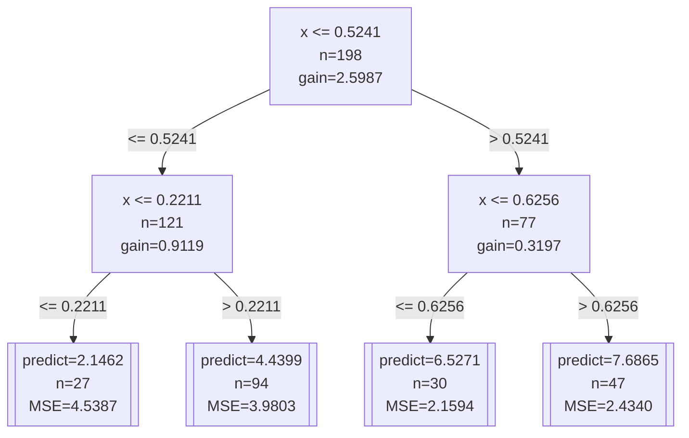

```mermaid
graph TD
    N0["x <= 0.5241<br>n=198<br>gain=2.5987"]
    N1["x <= 0.2211<br>n=121<br>gain=0.9119"]
    N2["x <= 0.6256<br>n=77<br>gain=0.3197"]
    N3[["predict=2.1462<br>n=27<br>MSE=4.5387"]]
    N4[["predict=4.4399<br>n=94<br>MSE=3.9803"]]
    N5[["predict=6.5271<br>n=30<br>MSE=2.1594"]]
    N6[["predict=7.6865<br>n=47<br>MSE=2.4340"]]

    N0 -->|"<= 0.5241"| N1
    N0 -->|" > 0.5241"| N2
    N1 -->|"<= 0.2211"| N3
    N1 -->|" > 0.2211"| N4
    N2 -->|"<= 0.6256"| N5
    N2 -->|" > 0.6256"| N6
```
