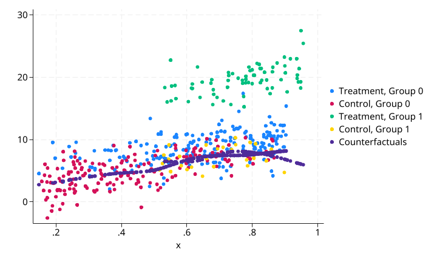

# nwreg 使用示例

本文档基于 `examples/nwreg/nwreg_with_treat.do` 中的测试场景，说明 `nwreg` 命令在因果推断中用于反事实预测的核心功能与使用原理。

---

## 命令简介

`nwreg` 是 Nadaraya-Watson 核回归的 Stata 插件实现，使用核加权局部平均估计条件期望 $\mathbb{E}[Y | X]$。其核心优势在于：

- **target 选项**：支持训练/预测分离。`target=0` 的观测用于训练（核密度估计、带宽选择），`target=1` 的观测仅接收预测但不参与训练。这一特性使其天然适合因果推断中的**反事实预测**场景。
- **group 选项**：支持多维度分组变量，在每个子群内部独立进行核回归估计。
- **带宽选择**：支持 Silverman 规则、Scott 规则和 K 折交叉验证（`bw(cv)`）。
- **标准误估计**：`se(varname)` 输出异方差稳健的局部标准误，支持三种残差调整方法。
- **多种核函数**：Gaussian、Epanechnikov、Uniform、Triweight、Cosine。

数学上，Nadaraya-Watson 估计量为：

$$
\hat{m}_h(x) = \frac{\sum_{i=1}^{n_{\text{train}}} K_h(x - X_i) \cdot Y_i}{\sum_{i=1}^{n_{\text{train}}} K_h(x - X_i)}
$$

其中 $K_h(u) = K(u/h)$ 为缩放核函数，$h$ 为带宽。估计量是局部加权平均：距离估计点 $x$ 越近的训练观测获得越高的权重。

---

## 数据构造

使用与 `fangorn` 示例相同的数据生成过程（DGP），以便对比两种方法在相同场景下的表现。

生成 5000 个观测：
- `g = mod(_n,2)==0`：分组变量（0/1），模拟两个子群体
- `x ∼ N(1 + 2g, 2)`：协变量，不同组的均值不同（组0均值≈1，组1均值≈3）
- `treatment = x > runiform()`：处理变量，取值0/1，基于 `x` 的非随机分配
- `y = 1 + 2·treatment + 10·treatment·g + 10·sin(x) + ε, ε ∼ N(0, 2)`：结果变量

**关键设计**：处理效应存在显著的组间异质性——`g=0` 组的处理效应约为 2，而 `g=1` 组的处理效应约为 12（因为 `10·treatment·g` 项）。结果变量 `y` 与协变量 `x` 之间存在非线性关系（`10·sin(x)` 项），核回归可以灵活捕捉这种非线性。

**CSA 预筛选**：

```stata
csadensity x, group(g) treatment(treatment) gen(csa)
```

先使用 `csadensity` 识别处理组与对照组在协变量 `x` 上的共同支持域（CSA），仅在 CSA 内进行后续分析。执行后保留 473 个观测（共 5000 个），说明处理组与对照组在 `x` 上的重叠区域有限。

---

## 测试：核回归反事实预测（target + group 选项）

### 测试目的

验证 `nwreg` 在 `target()` + `group()` 组合下的反事实预测能力：用对照组（`target=0`）数据训练核回归模型，然后预测处理组（`target=1`）在"未接受处理"条件下的反事实结果，进而估计个体处理效应。同时使用 `group(g)` 选项确保每个子群内部独立估计。

### 执行命令

```stata
nwreg y x, target(treatment) group(g) gen(conterfacurals) if(csa==1)
```

- `target(treatment)`：`treatment=0` 的观测（对照组）用于训练（选择带宽、估计核权重），`treatment=1` 的观测（处理组）只接收预测
- `group(g)`：在 `g=0` 和 `g=1` 两个子群内**分别**进行核回归估计，每个子群有自己的带宽
- `gen(conterfacurals)`：生成核回归的拟合/预测值变量

### 可视化结果

**原始数据散点图**（四组）：


图中颜色区分：
- 蓝色：`treatment=0, g=0`（对照组，组0）
- 红色：`treatment=1, g=0`（处理组，组0）
- 绿色：`treatment=0, g=1`（对照组，组1）
- 黄色：`treatment=1, g=1`（处理组，组1）

`y` 与 `x` 之间的正弦非线性关系清晰可见。处理组（红色和黄色）在 `x` 取值上整体高于对照组，这是非随机处理分配的结果。

**CSA + 反事实预测结果**：



灰色点（`conterfacurals`）是处理组观测的反事实预测值——即如果它们未被处理（`treatment=0`），在给定 `x` 条件下的期望结果。核回归在每个子群内独立估计，灰色点沿着对照组数据的趋势延伸。

### 处理效应估计

```stata
gen te = y - conterfacurals if treatment==1 & csa==1
bysort g: su te
```

| 组 | 观测数 | 均值 | 标准差 | 最小值 | 最大值 |
|---|-------|------|--------|--------|--------|
| g=0 | 204 | 2.110 | 2.133 | -3.769 | 9.912 |
| g=1 | 71 | 12.357 | 2.483 | 7.198 | 21.408 |

**结果解读**：核回归成功捕捉到了组间处理效应的异质性：
- `g=0` 组：平均处理效应约 2.11，与真实 DGP 中的 `2·treatment` 项（效应=2）高度吻合
- `g=1` 组：平均处理效应约 12.36，与真实 DGP 中的 `2·treatment + 10·treatment·g` 项（效应=12）高度吻合

### 为什么使用 group(g)

如果不使用 `group(g)` 选项，核回归会将两个子群的数据池化（pool）在一起，使用一个全局共享的带宽来估计 $\mathbb{E}[Y | X]$。但在这个 DGP 中，两个子群的数据生成过程本质上不同：

- `x` 的分布不同：$x_{g=0} \sim N(1, 2)$ vs $x_{g=1} \sim N(3, 2)$
- `treatment` 的分配依赖于 `x`（`treatment = x > runiform()`），导致控制组中 `g=0` 和 `g=1` 的 `x` 取值范围差异很大
- 当我们用控制组（`treatment=0`）训练模型时，两个子群的训练数据来自 $x$ 分布的不同区域

将两个子群池化后做全局核回归，实际上是在用一个平滑函数去拟合两个不同数据生成过程的混合——这会导致反事实预测在两个子群中都有偏。使用 `group(g)` 后，每个子群拥有独立的带宽：

```
Nadaraya-Watson kernel regression complete
  Group variables: 1
  Groups: 2
```

这意味着 `g=0` 和 `g=1` 两组各自在其 $x$ 分布区域内独立估计 $\mathbb{E}[Y | X]$，互不干扰，从而得到更准确的反事实预测。

### 与 fangorn 的对比

在相同数据上，`nwreg` 与 `fangorn`（单决策树）的处理效应估计结果非常接近：

| 方法 | g=0 组 TE 均值 | g=1 组 TE 均值 | 真实效应 |
|------|:--------------:|:--------------:|:--------:|
| nwreg（核回归） | 2.11 | 12.36 | 2 / 12 |
| fangorn（单决策树） | 2.12 | 12.09 | 2 / 12 |
| fangorn（RF 100树） | 3.08 | 12.46 | 2 / 12 |

核回归与单决策树在 `g=0` 组的表现几乎一致（2.11 vs 2.12），在 `g=1` 组也相差不大（12.36 vs 12.09）。这验证了两种方法在非线性反事实预测中的有效性。

---

## 使用建议

1. **先做 CSA 预筛选**：在因果推断中使用 `nwreg` 做反事实预测前，建议先用 `csadensity` 筛选共同支持域。缺乏共同支持的观测会产生不可靠的外推预测（当估计点距离所有训练观测都很远时，核权重几乎为零，结果趋于缺失值）。
2. **target 选项是因果推断的关键**：`target(treatment)` 允许用对照组训练、对处理组做反事实预测。这确保了处理组的预测完全基于对照组的模式，不会被处理效应"污染"。
3. **group 选项保证组内可比性**：当数据存在明显的子群体（如性别、地区、行业）时，使用 `group()` 在每个子群内独立估计，避免不同群体间的分布差异干扰估计。
4. **带宽选择**：默认 `bw(silverman)` 在大多数场景下表现良好。若数据量大且需要最优带宽，使用 `bw(cv)` 进行交叉验证选择。`bw(scott)` 是比 Silverman 略微平滑的选择。
5. **标准误输出**：添加 `se(se_var)` 选项输出异方差稳健的标准误，`se_type(1)` 使用留一法残差获得无偏估计。
6. **核函数选择**：默认 Gaussian 核适用于大多数场景。若协变量分布有界，可考虑 Epanechnikov 或 Triweight 等紧支撑核函数，计算效率更高。
7. **CSA规模考量**：本示例中 CSA 仅保留 473/5000 个观测（约 9.5%），这是因为处理分配与协变量高度相关，导致共同支持域很小。在实际应用中，CSA 的规模取决于处理分配机制与协变量重叠程度。
