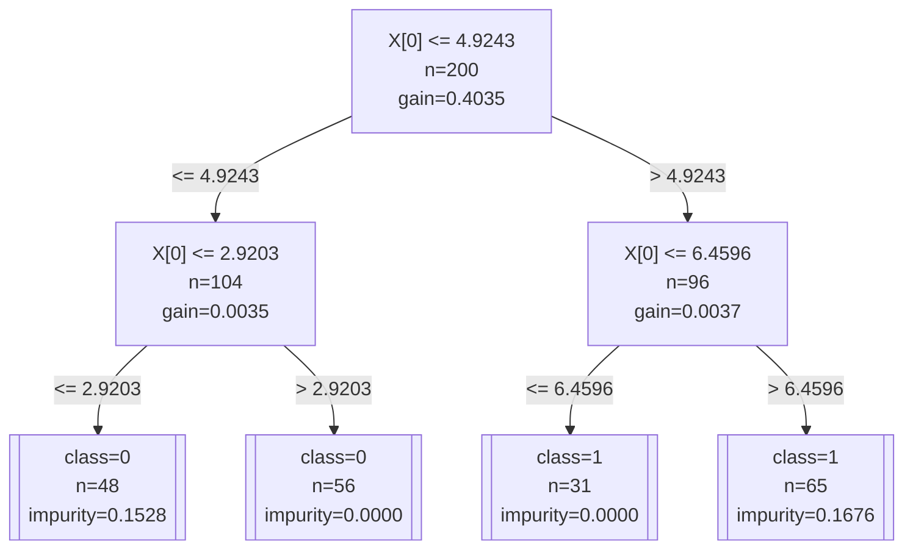

# fangorn - Decision Tree & Random Forest Stata Plugin

A high-performance C plugin for Stata implementing CART (Classification and Regression Trees) with support for classification (Gini, Entropy) and regression (MSE). Phase 1 provides a single decision tree; Phases 2-3 will extend to random forests with feature importance, OOB error, and best-first tree growth.

---

## Table of Contents

1. [Mathematical Principles](#mathematical-principles)
   - [CART Algorithm](#cart-algorithm)
   - [Impurity Functions](#impurity-functions)
   - [Pre-sorted Index Inheritance](#pre-sorted-index-inheritance)
   - [Incremental Split Evaluation](#incremental-split-evaluation)
   - [Cross-Validated Depth Selection](#cross-validated-depth-selection)
2. [Data Structures](#data-structures)
3. [C Function Reference](#c-function-reference)
   - [ent.h / ent.c](#enth--entc---tree-structures-and-construction)
   - [split.h / split.c](#splith--splitc---impurity-and-split-finding)
   - [utils_rf.h / utils_rf.c](#utils_rfh--utils_rfc---utilities)
   - [fangorn.c](#fangornc---stata-plugin-entry)
4. [Compilation](#compilation)
5. [Variable Layout](#variable-layout)

---

## Mathematical Principles

### CART Algorithm

fangorn implements the CART (Classification and Regression Trees) algorithm with recursive binary splitting:

1. **Start with all training data at the root node**
2. **For each node**, evaluate every feature and every possible split point to find the split that maximizes impurity decrease
3. **Split the node** into left (X ≤ threshold) and right (X > threshold) children
4. **Recursively repeat** steps 2-3 until a stopping condition is met
5. **Stopping conditions** (configurable):
   - `max_depth`: maximum tree depth reached
   - `min_samples_split`: node has fewer than N samples
   - `min_samples_leaf`: either child would have fewer than N samples
   - `min_impurity_decrease`: no split improves impurity by at least this amount (absolute, or relative via `relimpdec`)
   - `max_leaf_nodes`: post-prune tree to a maximum number of leaf nodes
   - All y values in the node are identical (perfect purity)

**Tree encoding**: Heap-style binary tree where root = 0, left child of node p = 2p+1, right child = 2p+2. Each node stores its heap `node_id` for leaf identification.

### Impurity Functions

Impurity measures how "mixed" the samples in a node are. Lower impurity = more homogeneous node.

#### Gini Impurity (Classification)

For a node with class counts (c₁, c₂, ..., cₖ) and total n samples:

$$
G = 1 - \sum_{i=1}^{k} \left(\frac{c_i}{n}\right)^2
$$

- Range: [0, 1 - 1/k]
- 0 = perfectly pure (all samples same class)
- Fast to compute; default for classification in scikit-learn

#### Entropy (Classification)

$$
H = -\sum_{i=1}^{k} p_i \log(p_i), \quad p_i = \frac{c_i}{n}
$$

- Range: [0, log(k)]
- 0 = perfectly pure
- More sensitive to class probabilities than Gini

#### MSE - Mean Squared Error (Regression)

For a node with values y₁, ..., yₙ:

$$
\bar{y} = \frac{1}{n}\sum_{i=1}^{n} y_i, \quad \text{MSE} = \frac{1}{n}\sum_{i=1}^{n}(y_i - \bar{y})^2
$$

- Measures variance of target values in the node
- Leaf prediction = mean of training samples in that leaf

### Split Quality Metric

The quality of a split is measured by **impurity decrease** (also called information gain):

$$
\Delta = I_{\text{parent}} - \left(\frac{n_{\text{left}}}{n} I_{\text{left}} + \frac{n_{\text{right}}}{n} I_{\text{right}}\right)
$$

Where I is the impurity (Gini, Entropy, or MSE). The split with maximum Δ is chosen. A split is rejected if Δ < `min_impurity_decrease`.

### Pre-sorted Index Inheritance

**Problem**: Naive CART evaluates splits by sorting samples at each node, which costs O(m · n log n) per node (m features, n samples).

**Solution**: Pre-sort all features once at tree construction time, then use index inheritance:

1. **Pre-computation** (`precompute_sorted_indices`): For each feature f, compute `sorted_indices[f][k]` = original observation index of the k-th smallest value in feature f. This costs O(m · n log n) once.

2. **Index inheritance** (`find_best_split`): For a node containing subset S of samples:
   - Create boolean mask `in_node[obs] = 1` for all obs ∈ S
   - For each feature f, scan `sorted_indices[f]` top-to-bottom and collect only indices where `in_node[orig] == 1`
   - Result: `node_sorted` contains the indices in S sorted by feature f
   - Cost: O(n) per feature (single linear scan)

**Why it works**: If the global sort order for feature f is [3, 1, 4, 2, 5], and the node contains {1, 2, 4}, the inherited sort order is simply the subsequence [1, 4, 2] — no re-sorting needed.

### Incremental Split Evaluation

Given `node_sorted` (indices sorted by a feature), evaluate all split points in a single linear scan:

```
Initialize: all samples in right partition
For i = 0 to n_sorted - 2:
    Move sample node_sorted[i] from right to left
    If feature value == next feature value: continue (no valid split between equals)
    If left_n < min_samples_leaf or right_n < min_samples_leaf: continue
    Compute left_impurity and right_impurity incrementally
    Compute gain = parent_impurity - weighted_average(left_impurity, right_impurity)
    If gain > best_gain: record this split
```

**Incremental updates** avoid recomputing impurity from scratch:
- **Classification**: maintain `left_counts[]` and `right_counts[]` arrays; incrementally move counts
- **Regression**: maintain running sums `left_sum`, `left_sum_sq`; update with O(1) arithmetic

**Total complexity per node**: O(m · n) where m = n_features, n = node samples. Without pre-sorting: O(m · n log n).

### Cross-Validated Depth Selection

**Problem**: Choosing `max_depth` manually is error-prone. Too shallow → underfitting; too deep → overfitting.

**Solution**: Use K-fold cross-validation to select the optimal tree depth automatically.

**Algorithm**:

1. **Shuffle** the training indices using the LCG PRNG (seeded by `seed()`)
2. **Assign folds**: each observation gets a fold ID (0 to K-1), then fold IDs are shuffled
3. **For each candidate depth** d = 1, 2, ..., `max_depth`:
   - For each fold f = 0, ..., K-1:
     - Train a tree with `max_depth = d` on all observations **not** in fold f
     - Evaluate on fold f:
       - **Classification**: compute prediction accuracy
       - **Regression**: compute negative MSE (negative so that "higher = better" matches classification)
   - Average the fold scores
4. **Select** the depth with the highest average CV score
5. **Build the final tree** using the selected depth

**Requirements**:
- `entcvdepth >= 2`
- `n_train >= entcvdepth * 2` (at least 2 observations per fold)
- If requirements are not met, CV is skipped and `maxdepth()` is used directly

**Parallelization**: The depth loop is parallelized with `#pragma omp parallel for schedule(dynamic, 1)`, so each candidate depth is evaluated on a separate thread.

**Scoring convention**:

| Task | Score | Best |
|------|-------|------|
| Classification | Accuracy = (correct predictions) / n_test | 1.0 |
| Regression | Negative MSE = - Σ(yᵢ - ŷᵢ)² / n_test | 0.0 |

Both use "higher is better" so the same maximization logic works for both.

**Example**:

```stata
fangorn y x1 x2, generate(pred) entcvdepth(10) maxdepth(20)
```

This tries depths 1 to 20 with 10-fold CV and picks the best one.

---

## Regularization Methods

fangorn provides two regularization methods to control tree complexity and
prevent overfitting.

### Relative Min Impurity Decrease (`relimpdec`)

The `relimpdec(a)` parameter sets the minimum impurity decrease threshold to
a fraction of the root split's impurity decrease:

$$
\Delta_{\text{min}} = a \times \Delta_{\text{root}}
$$

where $\Delta_{\text{root}}$ is the impurity decrease achieved by the first
(most important) split. This adapts the stopping criterion to the scale of the
data: a dataset with strong signals sets a higher bar, while noisy datasets
set a lower bar.

**Implementation**: In `build_tree()`:
1. Evaluate the root node's best split with `min_impurity_decrease = 0`
2. Compute $\Delta_{\text{root}}$ from the best split
3. Set `params.min_impurity_decrease = a × Δ_root`
4. Proceed with normal recursive tree building

**Effect**: Higher values of $a$ produce shallower trees with fewer splits.
Setting $a = 0$ (default) disables the relative threshold and falls back to
the absolute `min_impurity_decrease()` value.

### Maximum Leaf Nodes (`maxleafnodes`)

The `maxleafnodes(N)` parameter limits the total number of leaf nodes in the
tree. When the tree exceeds this limit, the plugin applies **post-pruning**:
greedily removes the least important splits (those with the smallest impurity
decrease) until the leaf count is within the limit.

**Implementation**: In `build_tree()`, after recursive tree construction:
1. Count the current number of leaves
2. While `n_leaves > max_leaf_nodes`:
   - Find the internal node with the smallest `impurity_decrease > 0`
   - Mark that node as a leaf (prune its entire subtree)
   - Recompute the leaf count from root
3. Repeat until the limit is satisfied

**Effect**: Limits model complexity directly. Useful for interpretability
(smaller trees are easier to understand) and for building ensembles of
shallow trees.

### Combined Use

The two methods can be combined:

```stata
fangorn y x1 x2, generate(pred) relimpdec(0.1) maxleafnodes(8)
```

This applies both a relative impurity threshold (10% of root gain) and an
absolute leaf count limit (≤ 8 leaves). Both constraints are enforced
independently.

---

### TreeNode

```c
typedef struct {
    int    node_id;             /* heap ID: root=0, left=2p+1, right=2p+2 */
    int    parent_id;           /* heap ID of parent, -1 for root */
    int    depth;               /* depth in tree (root=0) */
    int    split_feature;       /* feature index for split, -1 if leaf */
    double split_threshold;     /* split value: X[feat] <= threshold → left */
    double impurity_decrease;   /* impurity reduction at this split */
    int    is_leaf;             /* 1 if leaf node */
    double leaf_value;          /* prediction: class majority or mean y */
    double leaf_impurity;       /* impurity at this leaf */
    int    n_samples;           /* number of training samples */
    int    left_child;          /* array index in tree->nodes[], -1 if none */
    int    right_child;         /* array index in tree->nodes[], -1 if none */
} TreeNode;
```

### DecisionTree

```c
typedef struct {
    TreeNode *nodes;            /* dynamic array of nodes */
    int       n_nodes;          /* current number of nodes */
    int       capacity;         /* allocated capacity (doubles on realloc) */
} DecisionTree;
```

Uses dynamic array with doubling strategy. Initial capacity = 128 nodes. Heap-style `node_id` allows O(tree depth) traversal without child pointers (though child array indices are stored for efficiency).

### Dataset

```c
typedef struct {
    double **X;                 /* [n_features][n_obs] column-major */
    double  *y;                 /* target values */
    int      n_obs;
    int      n_features;
    int      n_classes;         /* 0 for regression */
    int    **sorted_indices;    /* [n_features][n_obs] pre-sorted indices */
    int      has_sorted_indices;
} Dataset;
```

### TreeParams

```c
typedef struct {
    int    max_depth;                 /* maximum tree depth (-1 = unlimited) */
    int    min_samples_split;         /* minimum samples to attempt a split */
    int    min_samples_leaf;          /* minimum samples in any leaf */
    double min_impurity_decrease;     /* minimum impurity decrease (absolute) */
    double min_impurity_decrease_factor; /* relative to root split gain; 0=disabled */
    int    max_leaf_nodes;            /* -1 or 0 = unlimited */
    int    criterion;                 /* CRITERION_GINI / ENTROPY / MSE */
    int    is_classifier;             /* 1 = classification, 0 = regression */
    int    n_classes;                 /* number of classes (for classification) */
} TreeParams;
```

### SplitResult

```c
typedef struct {
    int    feature;             /* best split feature index */
    double threshold;           /* best split threshold */
    double impurity_decrease;   /* impurity reduction achieved */
    int    left_n;              /* number of samples in left child */
    int    right_n;             /* number of samples in right child */
    int    found;               /* 1 if valid split found, 0 otherwise */
} SplitResult;
```

---

## C Function Reference

### ent.h / ent.c — Tree Structures and Construction

#### `DecisionTree *create_tree(void)`

Allocates and initializes an empty decision tree with capacity for 128 nodes.

**Returns**: pointer to `DecisionTree`, or `NULL` on allocation failure.

---

#### `void free_tree(DecisionTree *tree)`

Frees all memory associated with a decision tree (nodes array and tree struct).

**Parameters**:
- `tree`: pointer to `DecisionTree` (may be NULL, safely ignored)

---

#### `int add_node_to_tree(DecisionTree *tree, int depth, int heap_id, int parent_id)`

Appends a new uninitialized node to the tree's dynamic array. Automatically doubles capacity if needed.

**Parameters**:
- `tree`: target decision tree
- `depth`: depth of the new node (root = 0)
- `heap_id`: heap-style binary tree ID (root = 0, left = 2p+1, right = 2p+2)
- `parent_id`: heap ID of parent node (-1 for root)

**Returns**: array index of the new node, or -1 on allocation failure.

**Warning**: May reallocate `tree->nodes`. Never hold a `TreeNode*` across this call.

---

#### `void make_leaf(DecisionTree *tree, int node_idx, const Dataset *data, const int *sample_idx, int n_samples, const TreeParams *params)`

Converts a node into a leaf by computing its prediction value and impurity.

**Behavior**:
- **Classification**: counts class frequencies, sets `leaf_value` to majority class
- **Regression**: computes mean of y values, sets `leaf_value` to mean
- Sets `is_leaf = 1`, `n_samples`, `leaf_impurity`

**Parameters**:
- `tree`: decision tree
- `node_idx`: array index of node to convert
- `data`: dataset
- `sample_idx`: array of observation indices in this node
- `n_samples`: length of `sample_idx`
- `params`: tree parameters

---

#### `int all_same_y(const Dataset *data, const int *sample_idx, int n_samples)`

Checks if all target values in the given sample set are identical.

**Returns**: 1 if all y values equal (or n ≤ 1), 0 otherwise.

**Used for**: Early stopping when a node is perfectly pure.

---

#### `void build_node_recursive(DecisionTree *tree, int node_idx, Dataset *data, int *sample_idx, int n_samples, const TreeParams *params, int depth, int *n_leaves)`

Recursively builds the CART tree starting at `node_idx`.

**Algorithm**:
1. Check stopping conditions (min_samples_split, max_depth, all_same_y)
2. If stopping: make_leaf(), increment `*n_leaves`, return
3. Compute parent impurity
4. Call find_best_split() to find optimal feature/threshold
5. If no valid split found: make_leaf(), increment `*n_leaves`, return
6. Partition sample_idx into left_idx and right_idx
7. Create left and right child nodes via add_node_to_tree()
8. Recursively build left and right subtrees
9. Free temporary index arrays

**Parameters**:
- `tree`: decision tree being built
- `node_idx`: current node array index
- `data`: dataset with pre-sorted indices
- `sample_idx`: observation indices in current node
- `n_samples`: number of samples
- `params`: tree parameters
- `depth`: current depth
- `n_leaves`: pointer to running leaf count (for max_leaf_nodes post-pruning)

---

#### `void build_tree(DecisionTree *tree, Dataset *data, const TreeParams *params, int *sample_idx, int n_samples)`

Entry point for tree construction. Creates root node and initiates recursive building.
If `min_impurity_decrease_factor > 0`, computes the root split's impurity decrease
and scales it to set the relative threshold. After building, if `max_leaf_nodes > 0`,
performs post-pruning by greedily removing the least important splits (smallest
impurity decrease) until the leaf count is within the limit.

**Parameters**:
- `tree`: empty decision tree (from create_tree())
- `data`: dataset with pre-sorted indices
- `params`: tree parameters
- `sample_idx`: initial sample indices (usually all training data)
- `n_samples`: number of training samples

---

#### `double predict_tree(const DecisionTree *tree, const Dataset *data, int obs_idx)`

Traverses the tree for a single observation and returns the leaf's prediction value.

**Algorithm**: Start at root, at each internal node check if `X[feat][obs_idx] <= threshold`; go left if true, right otherwise. Return `leaf_value` when reaching a leaf.

**Returns**: predicted value (class index for classification, mean for regression).

---

#### `int get_leaf_id(const DecisionTree *tree, const Dataset *data, int obs_idx)`

Same traversal as predict_tree but returns the leaf's heap-style `node_id` instead of the prediction value.

**Returns**: leaf node ID (integer).

---

#### `int precompute_sorted_indices(Dataset *data)`

Pre-computes sorted_indices for all features to enable O(n) split finding.

**Algorithm**: For each feature f:
1. Copy feature values to temporary array
2. Call argsort_double() to get sorted order
3. Store in `data->sorted_indices[f]`

**Returns**: 0 on success, -1 on allocation failure.

**Memory**: Allocates `n_features × n_obs` integers.

---

#### `void free_sorted_indices(Dataset *data)`

Frees memory allocated by precompute_sorted_indices().

---

#### `int export_tree_mermaid(const DecisionTree *tree, const char *filename, const char **feature_names, const TreeParams *params)`

Exports the tree structure to a Mermaid flowchart file.

**Parameters**:
- `tree`: trained decision tree
- `filename`: output file path (overwritten if exists)
- `feature_names`: optional array of feature name strings (NULL to use `X[i]`)
- `params`: tree parameters (determines classification vs regression formatting)

**Output format**:
- Internal nodes: `N{heap_id}[feature ≤ threshold<br/>n=N<br/>gain=G]`
- Leaf nodes (classification): `N{heap_id}[[class=C<br/>n=N<br/>impurity=I]]`
- Leaf nodes (regression): `N{heap_id}[[predict=V<br/>n=N<br/>MSE=M]]`
- Edges: labeled with `≤ threshold` and `> threshold`

**Returns**: 0 on success, -1 on file I/O error.

---

### split.h / split.c — Impurity and Split Finding

#### `double gini_impurity(const double *y, const int *idx, int n, int n_classes)`

Computes Gini impurity for a set of samples.

**Formula**: $G = 1 - \sum_{c}(p_c)^2$ where $p_c = \text{count}_c / n$

**Parameters**:
- `y`: target values array
- `idx`: sample indices (subset of y)
- `n`: number of samples
- `n_classes`: number of classes

**Returns**: Gini impurity in [0, 1]. Returns 0 if n ≤ 0.

---

#### `double entropy_impurity(const double *y, const int *idx, int n, int n_classes)`

Computes entropy for a set of samples.

**Formula**: $H = -\sum_{c} p_c \log(p_c)$ where $p_c = \text{count}_c / n$

**Returns**: Entropy in [0, log(k)]. Returns 0 if n ≤ 0.

---

#### `double mse_impurity(const double *y, const int *idx, int n, int n_classes)`

Computes mean squared error (variance) for a set of samples.

**Formula**: $\text{MSE} = \frac{1}{n}\sum_{i}(y_i - \bar{y})^2$

**Note**: `n_classes` is unused (void cast) but kept for uniform function signature.

**Returns**: MSE ≥ 0. Returns 0 if n ≤ 0.

---

#### `ImpurityFunc get_impurity_func(int criterion)`

Returns the appropriate impurity function pointer based on criterion code.

**Parameters**:
- `criterion`: `CRITERION_GINI` (0), `CRITERION_ENTROPY` (1), or `CRITERION_MSE` (2)

**Returns**: function pointer to gini_impurity, entropy_impurity, or mse_impurity.

---

#### `void find_best_split(Dataset *data, const int *sample_idx, int n_samples, double parent_impurity, const TreeParams *params, SplitResult *result)`

Finds the optimal split across all features for a given node.

**Algorithm**:
1. Initialize `result->found = 0`, `result->impurity_decrease = min_impurity_decrease`
2. Build boolean mask `in_node[obs]` for fast membership testing
3. For each feature f:
   - Inherit sorted indices: scan global `sorted_indices[f]` and collect only obs ∈ node
   - Call `find_best_split_feature()` to evaluate all split points on this feature
4. Return best split found (if any)

**Parameters**:
- `data`: dataset with pre-sorted indices
- `sample_idx`: observation indices in current node
- `n_samples`: number of samples
- `parent_impurity`: impurity of current node before splitting
- `params`: tree parameters
- `result`: output structure (written in-place)

---

#### `static void find_best_split_feature(...)` (internal)

Evaluates all possible split points for a single feature using incremental updates.

**Algorithm** (see [Incremental Split Evaluation](#incremental-split-evaluation)):
- Initialize all samples in right partition
- Linear scan through sorted samples, moving one sample to left at each step
- Skip split points between equal feature values
- Skip if either child would violate `min_samples_leaf`
- Incrementally compute left/right impurity
- Track split with maximum impurity decrease

**Parameters**:
- `data`: dataset
- `feat`: feature index
- `node_sorted`: indices of node samples sorted by this feature
- `n_sorted`: length of node_sorted
- `parent_impurity`: impurity before splitting
- `params`: tree parameters
- `best`: in/out SplitResult (updated if better split found)

---

### utils_rf.h / utils_rf.c — Utilities

#### `void lcg_seed(lcg_state_t *state, unsigned int seed)`

Seeds the Linear Congruential Generator (LCG) random number generator.

**Parameters**:
- `state`: pointer to LCG state
- `seed`: initial seed (0 is treated as 1)

---

#### `unsigned int lcg_next(lcg_state_t *state)`

Generates next pseudo-random unsigned integer using Park-Miller LCG.

**Formula**: `state = 1664525 × state + 1013904223 (mod 2³²)`

**Returns**: random unsigned int in [0, 2³²).

---

#### `double lcg_uniform(lcg_state_t *state)`

Generates uniform random double in [0, 1).

**Returns**: `lcg_next(state) / 2³²`

**Note**: Used in Phase 2 for bootstrap sampling (not used in Phase 1).

---

#### `void argsort_double(double *values, int *indices, int n)`

Sorts indices by corresponding double values in ascending order.

**Algorithm**: Creates (value, index) pairs, sorts with qsort(), writes sorted indices.

**Parameters**:
- `values`: array of n double values
- `indices`: output array of n indices (0-based)
- `n`: array length

**On return**: `values[indices[0]] <= values[indices[1]] <= ... <= values[indices[n-1]]`

**Complexity**: O(n log n)

---

### fangorn.c — Stata Plugin Entry

#### `STDLL stata_call(int argc, char *argv[])`

Main entry point called by Stata's `plugin call` command.

**Workflow**:
1. **Parse options** from argv: nfeatures, ntarget, ngroup, nclasses, maxdepth, minsamplessplit, minsamplesleaf, minimpuritydecrease, minimpuritydecreasefactor, maxleafnodes, seed, type, criterion
2. **Validate parameters**: ensure nfeatures > 0, nclasses > 0 for classification
3. **Variable layout** (1-based Stata indices):
   ```
   Vars 1..n_features          : independent variables (features)
   Var  n_features + 1         : dependent variable (y)
   Var  n_features + 2         : target (if ntarget > 0)
   Vars n_features + 2 + ntarget .. n_features + 1 + ntarget + ngroup : group vars
   Var  n_features + 2 + ntarget + ngroup     : result (prediction output)
   Var  n_features + 3 + ntarget + ngroup     : leaf_id (leaf node ID output)
   Var  n_features + 4 + ntarget + ngroup     : touse (marker variable)
   ```
4. **Count observations**: scan touse variable, count where touse == 1
5. **Load data**: read features, y, target into C arrays for all touse == 1 observations
6. **Build training set**: if target variable exists, use only target == 0; otherwise use all
7. **Pre-sort indices**: call precompute_sorted_indices()
8. **Build tree**: create tree, set parameters, call build_tree()
9. **Predict and write back**: for all touse observations, compute prediction and leaf_id, write to result and leaf_id variables
10. **Cleanup**: free all allocated memory

**Returns**: 0 on success, non-zero on error.

---

## Compilation

### Linux
```bash
make fangorn
```

### macOS
```bash
make fangorn
```

### Windows (cross-compile from Linux/macOS)
```bash
make fangorn
```

Or manually:
```bash
x86_64-w64-mingw32-gcc -shared -fPIC -O3 -fopenmp -static-libgcc \
    -Wl,-Bstatic -lgomp -Wl,-Bdynamic \
    src/stplugin.c src/utils.c \
    fangorn/fangorn.c fangorn/ent.c fangorn/split.c fangorn/utils_rf.c \
    -o fangorn/fangorn.plugin
```

**Windows note**: Use `-static-libgcc` to avoid runtime DLL dependency issues in Stata.

---

## Variable Layout

The Stata ado wrapper (`fangorn.ado`) arranges variables in this order before calling the C plugin:

| Position | Content | Description |
|----------|---------|-------------|
| 1..p | indepvars | Feature variables (X) |
| p+1 | depvar | Target variable (y) |
| p+2 | target (optional) | Training/test split marker (0=train, 1=test) |
| p+3 .. p+2+g | group (optional) | Group variables |
| p+3+g | result | Output: prediction value |
| p+4+g | leaf_id | Output: leaf node ID (heap-style) |
| p+5+g | touse | Marker: 1 = use this observation |

Where p = number of independent variables, g = number of group variables.

**Key design decisions**:
- All observations with `touse == 1` receive predictions (both training and test)
- The C plugin only uses `target == 0` (or all if no target) for tree construction
- Predictions are written back for all `touse == 1` observations
- Missing values are not handled in C; filtered out via `touse` in the ado layer

---

## Mermaid Diagram Export

fangorn can export the trained decision tree as a **Mermaid flowchart** suitable for embedding in Markdown documents.

### Usage

```stata
fangorn y x1 x2, generate(pred) mermaid(tree.md)
```

This creates `tree.md` containing a Mermaid diagram:



### Diagram Elements

| Element | Meaning |
|---------|---------|
| `N{id}[...]` | Internal node: shows split feature, threshold, sample count, and impurity decrease |
| `N{id}[[...]]` | Leaf node: shows predicted class/value, sample count, and leaf impurity |
| Solid arrows `-->` | Split direction: left if ≤ threshold, right if > threshold |
| Edge labels | Threshold value for the split decision |

### Rendering

Mermaid diagrams are natively supported by:
- GitHub/GitLab Markdown rendering
- VS Code (with Mermaid extension)
- Obsidian, Notion, and many modern documentation tools
- Online: [Mermaid Live Editor](https://mermaid.live)

### C API

```c
int export_tree_mermaid(const DecisionTree *tree, const char *filename,
                        const char **feature_names, const TreeParams *params);
```

- `feature_names`: optional array of human-readable feature names (NULL to use `X[i]`)
- Returns 0 on success, -1 if file cannot be opened

---

## Appendix: Why "fangorn" and "ent"?

> *"I am not going to tell you my name, not yet at any rate."* — Treebeard

If you have read **J.R.R. Tolkien's *The Lord of the Rings***, the names will be immediately obvious:

- **fangorn** is **Treebeard** (Sindarin: *fanga* "beard" + *orn* "tree"), the eldest of the Ents and shepherd of Fangorn Forest. A fitting name for a decision-tree plugin, because Treebeard is quite literally the original decision tree — ancient, wise, and fond of making up his mind after long deliberation. He would certainly approve of recursive binary splitting, though he might complain that CART is *"hasty"*.

- **ent** refers to the **Ents**, the tree-shepherds of Middle-earth. Originally `tree.c`, the core tree-building module was renamed `ent.c` because, as Merry and Pippin discovered, an Ent *is* a tree that can walk, talk, and classify observations with remarkable accuracy. The Ents' motto — *"Do not be hasty"* — also applies to hyperparameter tuning.

Phase 1 (single tree) now includes the regularization methods from scikit-learn:
`relimpdec` (relative min impurity decrease) and `maxleafnodes` (post-pruning).
These are the first steps toward Phase 3, which will add best-first growth with
`ntiles` and `strategy`.

Phase 2 (Random Forest) will thus be a veritable **Entmoot**: an assembly of
many trees, each with its own opinion, reaching a collective decision through
democratic voting. Phase 3 (best-first growth with ntiles) may require the
**Huorns** — the wild, semi-sentient trees that lurk in the deeper forests,
capable of more complex strategies than their Ent cousins.

> *"There are no trees like the trees of that country."*
