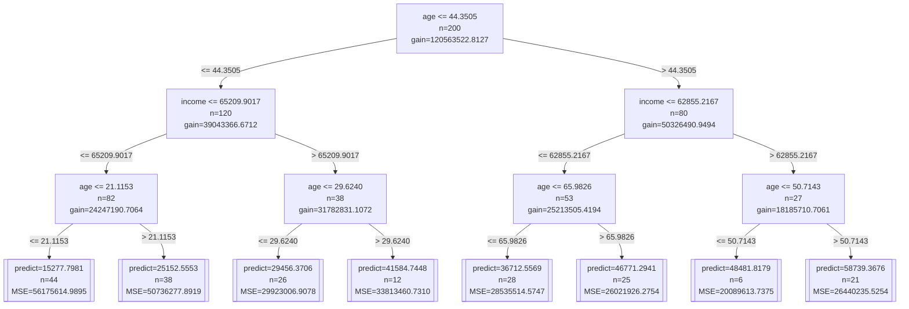

```mermaid
graph TD
    N0["age <= 44.3505<br>n=200<br>gain=120563522.8127"]
    N1["income <= 65209.9017<br>n=120<br>gain=39043366.6712"]
    N2["income <= 62855.2167<br>n=80<br>gain=50326490.9494"]
    N3["age <= 21.1153<br>n=82<br>gain=24247190.7064"]
    N4["age <= 29.6240<br>n=38<br>gain=31782831.1072"]
    N7[["predict=15277.7981<br>n=44<br>MSE=56175614.9895"]]
    N8[["predict=25152.5553<br>n=38<br>MSE=50736277.8919"]]
    N9[["predict=29456.3706<br>n=26<br>MSE=29923006.9078"]]
    N10[["predict=41584.7448<br>n=12<br>MSE=33813460.7310"]]
    N5["age <= 65.9826<br>n=53<br>gain=25213505.4194"]
    N6["age <= 50.7143<br>n=27<br>gain=18185710.7061"]
    N11[["predict=36712.5569<br>n=28<br>MSE=28535514.5747"]]
    N12[["predict=46771.2941<br>n=25<br>MSE=26021926.2754"]]
    N13[["predict=48481.8179<br>n=6<br>MSE=20089613.7375"]]
    N14[["predict=58739.3676<br>n=21<br>MSE=26440235.5254"]]

    N0 -->|"<= 44.3505"| N1
    N0 -->|" > 44.3505"| N2
    N1 -->|"<= 65209.9017"| N3
    N1 -->|" > 65209.9017"| N4
    N2 -->|"<= 62855.2167"| N5
    N2 -->|" > 62855.2167"| N6
    N3 -->|"<= 21.1153"| N7
    N3 -->|" > 21.1153"| N8
    N4 -->|"<= 29.6240"| N9
    N4 -->|" > 29.6240"| N10
    N5 -->|"<= 65.9826"| N11
    N5 -->|" > 65.9826"| N12
    N6 -->|"<= 50.7143"| N13
    N6 -->|" > 50.7143"| N14
```
