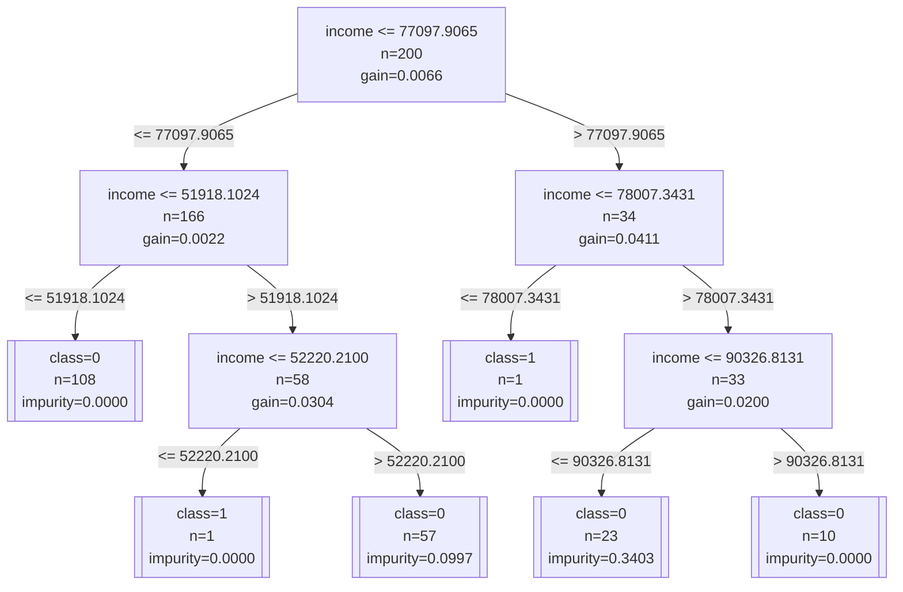

```mermaid
graph TD
    N0["income <= 77097.9065<br>n=200<br>gain=0.0066"]
    N1["income <= 51918.1024<br>n=166<br>gain=0.0022"]
    N2["income <= 78007.3431<br>n=34<br>gain=0.0411"]
    N3[["class=0<br>n=108<br>impurity=0.0000"]]
    N4["income <= 52220.2100<br>n=58<br>gain=0.0304"]
    N9[["class=1<br>n=1<br>impurity=0.0000"]]
    N10[["class=0<br>n=57<br>impurity=0.0997"]]
    N5[["class=1<br>n=1<br>impurity=0.0000"]]
    N6["income <= 90326.8131<br>n=33<br>gain=0.0200"]
    N13[["class=0<br>n=23<br>impurity=0.3403"]]
    N14[["class=0<br>n=10<br>impurity=0.0000"]]

    N0 -->|"<= 77097.9065"| N1
    N0 -->|" > 77097.9065"| N2
    N1 -->|"<= 51918.1024"| N3
    N1 -->|" > 51918.1024"| N4
    N2 -->|"<= 78007.3431"| N5
    N2 -->|" > 78007.3431"| N6
    N4 -->|"<= 52220.2100"| N9
    N4 -->|" > 52220.2100"| N10
    N6 -->|"<= 90326.8131"| N13
    N6 -->|" > 90326.8131"| N14
```
