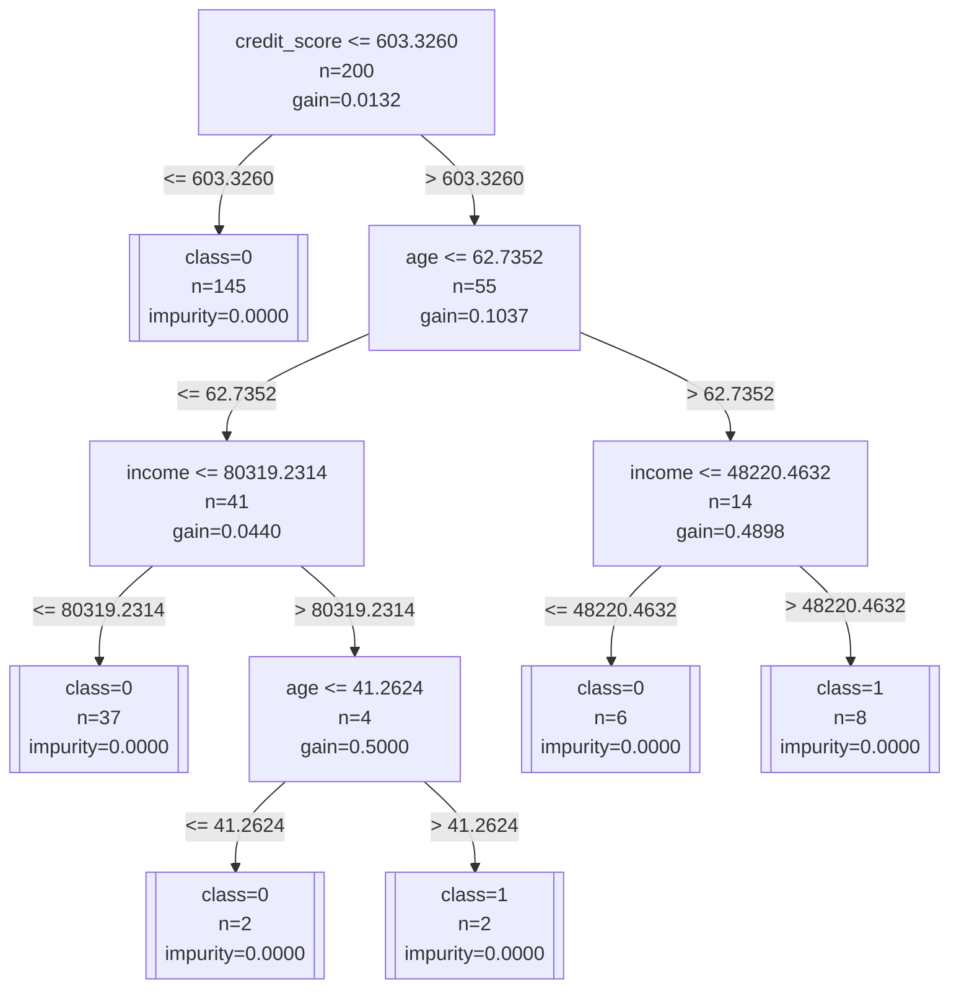

```mermaid
graph TD
    N0["credit_score <= 603.3260<br>n=200<br>gain=0.0132"]
    N1[["class=0<br>n=145<br>impurity=0.0000"]]
    N2["age <= 62.7352<br>n=55<br>gain=0.1037"]
    N5["income <= 80319.2314<br>n=41<br>gain=0.0440"]
    N6["income <= 48220.4632<br>n=14<br>gain=0.4898"]
    N11[["class=0<br>n=37<br>impurity=0.0000"]]
    N12["age <= 41.2624<br>n=4<br>gain=0.5000"]
    N25[["class=0<br>n=2<br>impurity=0.0000"]]
    N26[["class=1<br>n=2<br>impurity=0.0000"]]
    N13[["class=0<br>n=6<br>impurity=0.0000"]]
    N14[["class=1<br>n=8<br>impurity=0.0000"]]

    N0 -->|"<= 603.3260"| N1
    N0 -->|" > 603.3260"| N2
    N2 -->|"<= 62.7352"| N5
    N2 -->|" > 62.7352"| N6
    N5 -->|"<= 80319.2314"| N11
    N5 -->|" > 80319.2314"| N12
    N6 -->|"<= 48220.4632"| N13
    N6 -->|" > 48220.4632"| N14
    N12 -->|"<= 41.2624"| N25
    N12 -->|" > 41.2624"| N26
```
