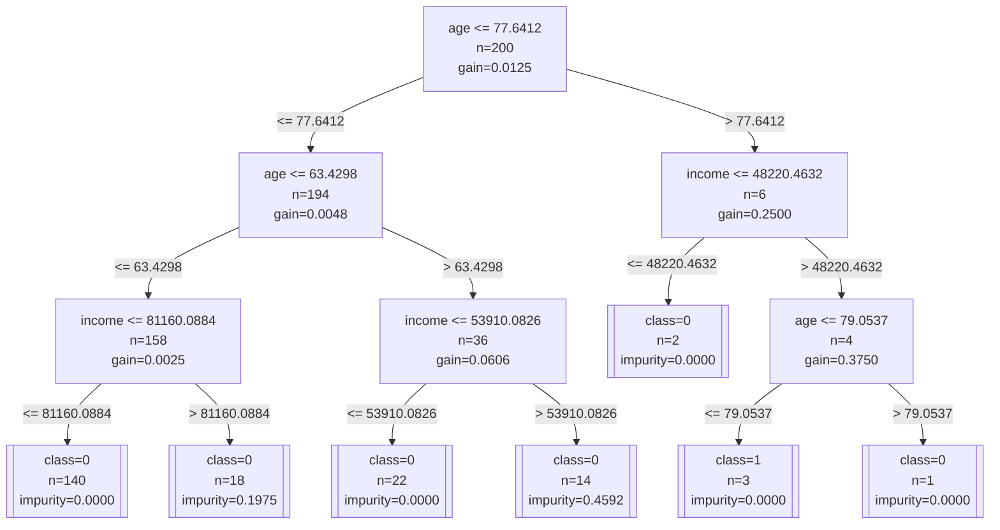

```mermaid
graph TD
    N0["age <= 77.6412<br>n=200<br>gain=0.0125"]
    N1["age <= 63.4298<br>n=194<br>gain=0.0048"]
    N2["income <= 48220.4632<br>n=6<br>gain=0.2500"]
    N3["income <= 81160.0884<br>n=158<br>gain=0.0025"]
    N4["income <= 53910.0826<br>n=36<br>gain=0.0606"]
    N7[["class=0<br>n=140<br>impurity=0.0000"]]
    N8[["class=0<br>n=18<br>impurity=0.1975"]]
    N9[["class=0<br>n=22<br>impurity=0.0000"]]
    N10[["class=0<br>n=14<br>impurity=0.4592"]]
    N5[["class=0<br>n=2<br>impurity=0.0000"]]
    N6["age <= 79.0537<br>n=4<br>gain=0.3750"]
    N13[["class=1<br>n=3<br>impurity=0.0000"]]
    N14[["class=0<br>n=1<br>impurity=0.0000"]]

    N0 -->|"<= 77.6412"| N1
    N0 -->|" > 77.6412"| N2
    N1 -->|"<= 63.4298"| N3
    N1 -->|" > 63.4298"| N4
    N2 -->|"<= 48220.4632"| N5
    N2 -->|" > 48220.4632"| N6
    N3 -->|"<= 81160.0884"| N7
    N3 -->|" > 81160.0884"| N8
    N4 -->|"<= 53910.0826"| N9
    N4 -->|" > 53910.0826"| N10
    N6 -->|"<= 79.0537"| N13
    N6 -->|" > 79.0537"| N14
```
